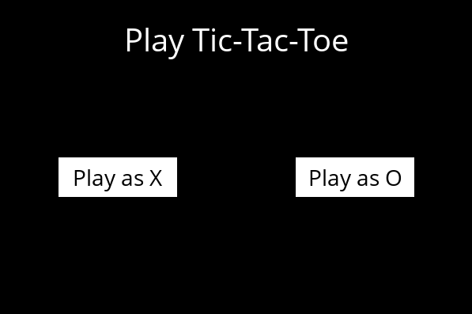
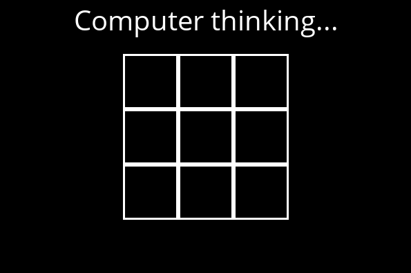
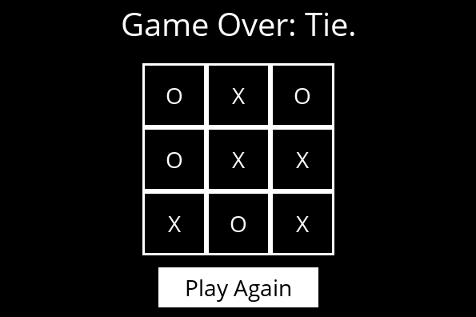
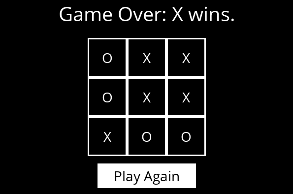

# Alpha-Beta Pruning
## Introduction
The Alpha-Beta Pruning algorithm is an optimization of the [Minimax](https://en.wikipedia.org/wiki/Minimax) algorithm. At each step, it chooses the move that maximizes the current player's gain while minimizing the opponent's gain, just like Minimax. However, Alpha-Beta Pruning eliminates (or "prunes") parts of the decision tree that cannot influence the final decision, thereby reducing the number of nodes evaluated. The algorithm maintains two values, alpha and beta, which represent the bounds of the best options found for maximizing and minimizing, respectively. If a node is found to be less promising than a previously examined node, it is discarded. This allows the algorithm to choose the most promising move more efficiently, considering both the player's moves and the opponent's responses, ensuring the best strategy to win or draw the game.

## Usage
```bash
python runner.py
```

## Game





## References
- [CS50’s Introduction to Artificial Intelligence with Python](https://cs50.harvard.edu/ai/2024/)
