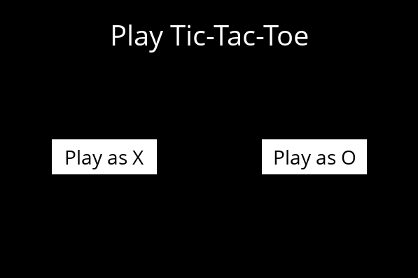
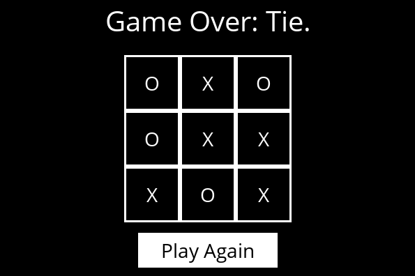

# Depth-Limited Minimax
## Introduction
The Depth-Limited Minimax algorithm, at each step, chooses the move that maximizes the current player's gain while minimizing the opponent's gain, but only up to a specified depth in the game tree. It simulates all possible moves up to the given depth, assigning values to the states at that depth based on a heuristic evaluation function if the terminal state is not reached. At each level of the decision tree, the player selects the move with the maximum value, while the opponent selects the move with the minimum value, alternating between maximization and minimization. This allows the algorithm to choose the most promising move within the depth limit, considering both the player's moves and the opponent's responses, ensuring the best strategy within the computational constraints.

## Usage
```bash
python runner.py
```

## Game





## References
- [CS50’s Introduction to Artificial Intelligence with Python](https://cs50.harvard.edu/ai/2024/)
