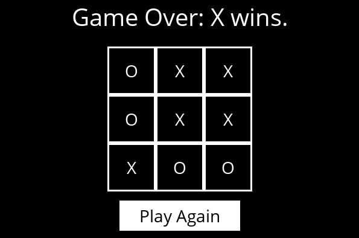

# Minimax
## Introduction
The Minimax algorithm, at each step, chooses the move that maximizes the current player's gain while minimizing the opponent's gain. It simulates all possible moves until the end of the game, assigning values to final states (win, draw, or loss). At each level of the decision tree, the player selects the move with the maximum value, while the opponent selects the move with the minimum value, alternating between maximization and minimization. This allows the algorithm to choose the most promising move, considering both the player's moves and the opponent's responses, ensuring the best strategy to win or draw the game.

## Usage
```bash
python runner.py
```

## Game




## References
- [CS50’s Introduction to Artificial Intelligence with Python](https://cs50.harvard.edu/ai/2024/)
