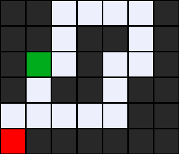
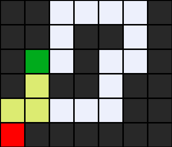
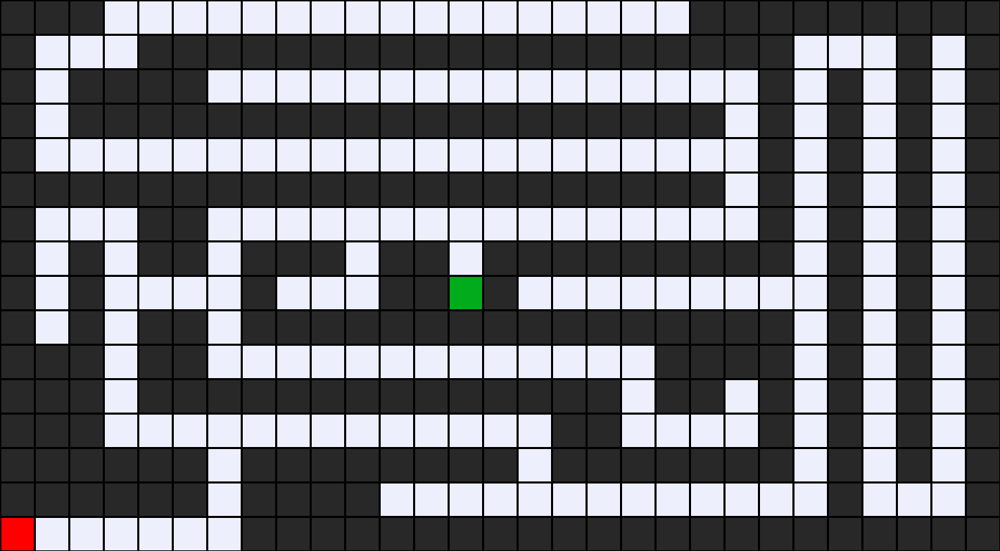
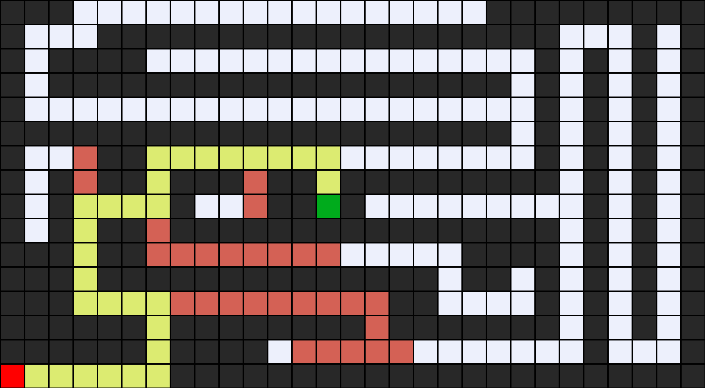
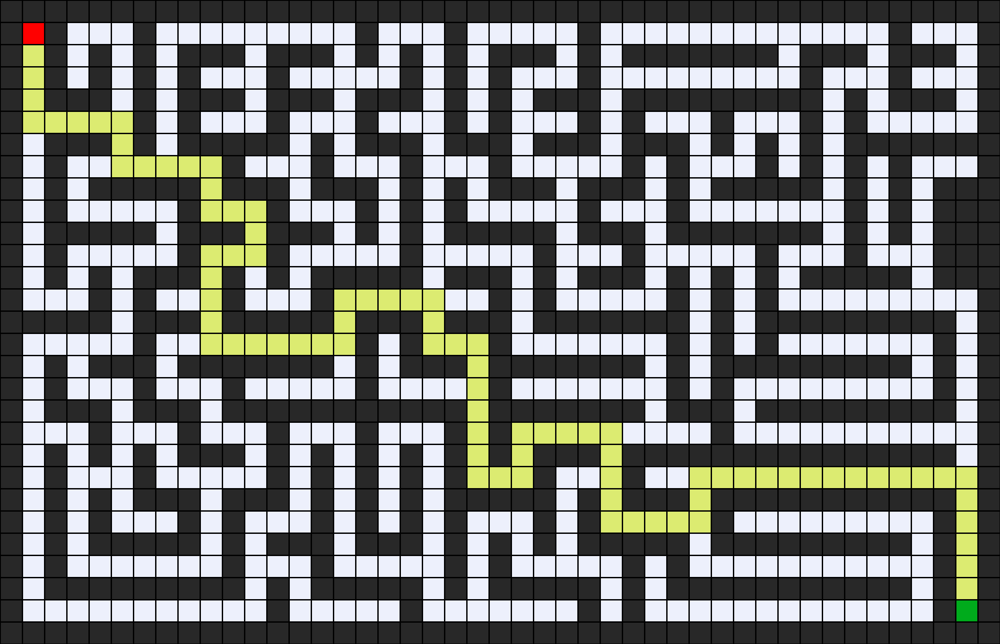
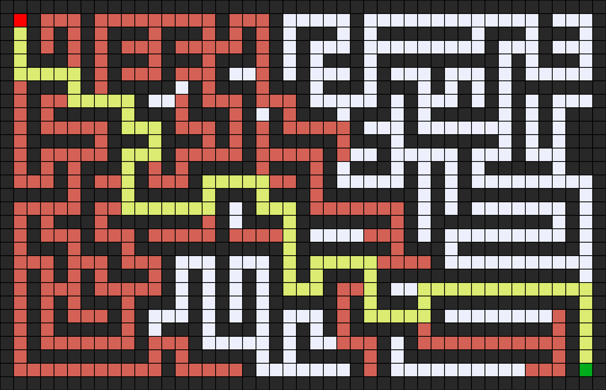

# A*
## Introduction
In the A* algorithm, at each step, the node to be expanded is chosen based on the function $f(n)$, which is the sum of the current cost $g(n)$ and the heuristic $h(n)$. This allows the algorithm to choose the most promising path, considering both the current cost and an estimate of the remaining cost to the goal.

$$f(n) = g(n) + h(n)$$

- $f(n)$ is the total cost function.
- $g(n)$ is the cost of the path from the start node to the current node $n$.
- $h(n)$ is the heuristic, in this case, the Manhattan distance.

The formula for the [Manhattan distance](https://simple.wikipedia.org/wiki/Manhattan_distance) heuristic, represented by

$$\lvert x_{goal} - x_{n} \rvert + \lvert y_{goal} - y_{n} \rvert$$

Where $(x_{goal}, y_{goal})$ are the coordinates of the goal node and $(x_{n}, y_{n})$ are the coordinates of the current node $n$.

## Usage
```bash
python maze.py maze.txt
```

## Examples
### Maze 1

### Solution 1

### States Explored: 5


### Maze 2

### Solution 2

### States Explored: 59


### Maze 3

### Solution 3

### States Explored: 351


## References
- [CS50’s Introduction to Artificial Intelligence with Python](https://cs50.harvard.edu/ai/2024/)
