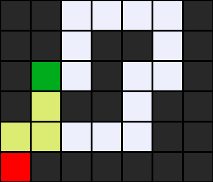

# Greedy Best-First Search (GBFS)
## Introduction
The Greedy Best-First Search (GBFS) algorithm with the Manhattan distance heuristic is an informed search technique that prioritizes expanding nodes that are closest to the goal, measured by the straight-line distance between them (also known as [Manhattan distance](https://simple.wikipedia.org/wiki/Manhattan_distance)).

The Manhattan distance is calculated by summing the absolute differences in 𝑥 and 𝑦 coordinates between two points on a plane.

$$\lvert x_{goal} - x_{n} \rvert + \lvert y_{goal} - y_{n} \rvert$$

Where $(x_{goal}, y_{goal})$ are the coordinates of the goal node and $(x_{n}, y_{n})$ are the coordinates of the current node $n$.

## Usage
```bash
python maze.py maze.txt
```

## Examples
### Maze 1

### Solution 1

### States Explored: 5


### Maze 2

### Solution 2

### States Explored: 54


### Maze 3

### Solution 3

### States Explored: 175


## References
- [CS50’s Introduction to Artificial Intelligence with Python](https://cs50.harvard.edu/ai/2024/)
