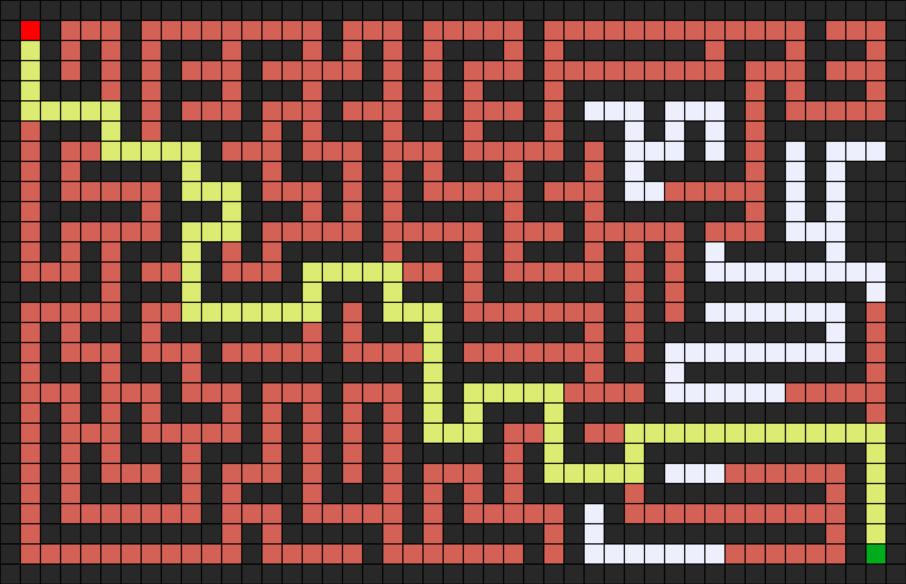

# Breadth-First Search (BFS)
## Introduction
A breadth-first search (BFS) algorithm explores graph or tree structures by traversing level by level, visiting all nodes at the current depth before moving on to nodes at the next depth level. This strategy involves managing the frontier, which is the set of nodes that are yet to be explored. In BFS, the frontier is typically handled using a queue data structure, adhering to the "first-in, first-out" (FIFO) principle.

## Usage
```bash
python maze.py maze.txt
```

## Examples
### Maze 1

### Solution 1

### States Explored: 6


### Maze 2

### Solution 2

### States Explored: 77


### Maze 3

### Solution 3

### States Explored: 545


## References
- [CS50’s Introduction to Artificial Intelligence with Python](https://cs50.harvard.edu/ai/2024/)
