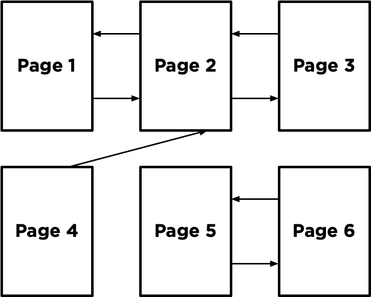

# PageRank
[PageRank](https://en.wikipedia.org/wiki/PageRank) is an algorithm used by Google Search to rank web pages in their search engine results. It measures the importance of website pages by considering the number and quality of links to them, aiming to determine the likelihood of a user reaching a particular page through random web surfing.

## Usage
```bash
python pagerank.py corpus
```

## Random Surfer Model
### Introduction
- PageRank can be understood through the random surfer model.
- This model considers a hypothetical surfer on the internet who clicks on links randomly.
- A corpus of web pages is used to illustrate this model, where arrows between pages represent links.


### Behavior of the Random Surfer
- The surfer starts at a random page and randomly chooses links to follow.
- For example, if on page 2, they randomly choose between pages 1 and 3 to visit next.
- Duplicate links on the same page are treated as a single link, and links to the same page are ignored.

### PageRank and Probability
- PageRank of a page is the probability of a random surfer being on that page at any given time.
- Pages with more links have a higher chance of being visited by the surfer.
- Links from more important sites are more likely to be clicked than those from less important sites.

### Interpretation as a Markov Chain
- The model can be interpreted as a [Markov Chain](https://en.wikipedia.org/wiki/Markov_chain), where each page is a state.
- Transitions between states are made randomly through links.

### Disconnected Corpus
- When randomly sampling pages from a disconnected corpus, certain pages may end up with biased PageRank estimates.
- This bias occurs when the random surfer gets stuck in a loop due to lack of connections between pages.



- Suppose we start by sampling Page 5 randomly from the corpus.
- Since Page 5 only links to Page 6 and vice versa, the surfer alternates between these two pages indefinitely.
- This looping results in an estimate of 0.5 for the PageRank of Pages 5 and 6.
- All other pages, which were not visited, end up with an estimated PageRank of 0.
- To address this issue, a damping factor ($d$) is introduced to the model, typically set around $0.85$.
- With probability $d$, the random surfer chooses a link from the current page randomly.
- The random surfer starts by choosing a page randomly from the corpus.
- For each additional sample, they choose a link from the current page with probability $d$ and any page with probability $1 - d$.
- By tracking how many times each page appears as a sample, we can determine the proportion of states on each page.
- This proportion serves as an estimate of the PageRank for each page within the disconnected corpus.

## Iterative Algorithm
This formula is applied iteratively until the PageRank values converge to a stable set of values, indicating the relative importance of each page within the network.

$$PR(p) = \frac{1 - d}{N} + d \sum_{i} \frac{PR(i)}{NumLinks(i)}$$

### PageRank $PR(p)$
- $PR(p)$ represents the probability that a random surfer ends up on a given page $p$.

### Two Ways to Define $PR(p)$
1. With probability $1 - d$, the surfer chose a page at random and ended up on page $p$.
2. With probability $d$, the surfer followed a link from a page $i$ to page $p$.

### Mathematical Expression for $PR(p)$
1. For the first condition,

$$PR(p) = \frac{1 - d}{N}$$

where $N$ is the total number of pages in the corpus.

2. For the second condition,

$$PR(p) = \sum_{i} \frac{PR(i)}{NumLinks(i)}$$

where $i$ ranges over all pages that link to page $p$, and $NumLinks(i)$ is the number of links present on page $i$.

### Calculating PageRank Values
1. Start by assuming the PageRank of every page is $1 / N$ (equally likely to be on any page).
2. Use the PageRank formula to calculate new PageRank values for each page, based on the previous values.
3. Repeat this process iteratively until PageRank values converge (i.e., not change significantly with each iteration).

## Implementation in the Project
- This project will implement both approaches for calculating PageRank: sampling pages from a Markov Chain random surfer and iteratively applying the PageRank formula.

## References
- [CS50’s Introduction to Artificial Intelligence with Python](https://cs50.harvard.edu/ai/2024/)
